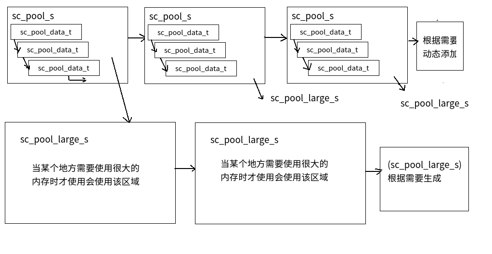

# 简易内存分配器的说明
一个简易的C++内存管理器实现总体结构如下所示：



该内存分配器的刚开始使用是通过`sc_pool_s *sc_create_pool (size_t size)`函数创建一个字节大小为size的`sc_pool_s`对象，该对象由一个链表结构的`sc_pool_data_t`和一个指向`sc_pool_large_s`的结构体指针组成，其中`sc_pool_data_t`用来处理小内存申请的需求，而`sc_pool_large_s`则用来处理大内存申请的请求，且根据需要动态的扩展，形成一个链表结构。

### 一些其他内容的说明

#### 1. 内存对齐方式的实现

```C++
#define sc_align_ptr(p, a)                                                   \
  (unsigned char *) (((unsigned long int ) (p) + ((unsigned long int ) a - 1)) & ~((unsigned long int ) a - 1))
```

这段代码的意思就是返回一个以大小为`a`的内存对齐方式，要解释这段代码，假设里面的变量都是`unsigned long `类型的，将其简化成如下形式：

```C++
(p +(a - 1)) & ~(a - 1)
```

​	先解释`~(a - 1)`，假设现在的对齐方式是16字节的方式对齐（一般都是将地址2的幂次进行对齐），即`a = 16`，现在将`a - 1`取反后的二进制为`10000`，将这个二进制数与任何数相与，都会产生后4位为0的二进制数，而其他位数不变，这个数此时恰好就是`a = 16`的倍数。而`p + (a - 1)`则是要获取比起始地址`p`要大的数，且这个数要尽可能的不会影响原来已经分配了内存的空间，但又不会比`p`大太多从而造成内存碎片，则所加的数是`a-1`满足该要求。

​	例如此时p的基址为17（假设从0开始分配，已经为某处分配了17字节的大小的内存，现在从p=17开始申请内存）。`p + (a - 1)`的值为`0...010001  + 0...01111 = 100000`，此时`(p +(a - 1)) & ~(a - 1)`相与的结果是`0...0100000`  & `1...10000` =`0...0100000` = 32；即地址不会从17开始，而只会从32开始，有利于快速读取操作。

**内存对齐方式的原因**

1. 内存对齐后，可以更方便读取的存取数据。
2. 不是全部硬件平台都能访问随意地址上的随意地址，为了兼容性，需要做内存对齐。

**解释**

​	对于大多数语言来说，这部分实现是由编译器来实现的（编译器将每个”数据单元“放在合适的内存位置上），但是Ｃ/C++太强大，太灵活了，允许你去干预”内存对齐“。

以如下程序做说明：

```C++
struct{
    char a;
    char b;
    int c;
} Struct1;
struct{
    char a;
    int c;
    char b;
} Struct2;
int main()
{
    cout << "Struct1 : " << sizeof(Struct1) << endl;  // Struct1 : 8
    cout << "Struct2 : " << sizeof(Struct2) << endl;  // Struct2 : 12
    return 0;
}
```

原因是**linux中默认对齐方式的值为4**，在`struct1`中，前两个字节表示共占２字节的大小，第一块内存的位置可以放下，然后一个`int`占4个字节，而第一个内存里只能容下两个字节的数据存放，所以就会放到第二块内存位置中去；同理，在结构体`struct2`中，第一块内存只能容纳一个`char`类型的字符，而4字节的`int`要放到 第二块内存里，第三个`char`此时只能放到 第三块内存中去了。

|  结构体   | 内存块1(４字节) | 内存块2(４字节) | 内存块3(４字节) |
| :-------: | :-------------: | :-------------: | :-------------: |
| `Struct1` |       a,b       |        c        |                 |
| `Struct2` |        a        |        c        |        b        |

经过内存对齐后，CPU的内存访问速度大大提升。如果操作1字节的数据，可以是任意地址；若是操作2字节的数据，如果开始地址在偶数地址，一次就可以取2字节，如果开始地址在奇数，就要2次内存操作才能完成；如果操作4字节的数据，最好开始地址在能被4整除的数值上，这样可以用一条32位的内存操作指令完成。同样，8字节的开始位置最好的能被8整除的数值上，这样可以用一条64位的内存操作指令完成。就是说，如果对齐了，一次就可以完成，不对齐，就可能多次才能完成。这样，只要你在结构体里对象之间能处理好对齐，你的数据就能操作得很快。

#### 2. 函数 posix_memalign() 使用说明

功能：返回size字节的动态内存，预对齐内存的分配。posix_memalign函数的用法类似于malloc的用法，由posix_memalign分配的内存空间，需要由free释放。

头文件：`#include <stdlib.h>`

函数原型：`int posix_memalign (void **memptr,size_t alignment,size_t size);`

参数：

- memptr           分配好的内存空间的首地址
- alignment        对齐边界，Linux中，32位系统是8字节，64位系统是16字节
- size                  指定分配size字节大小的内存

返回值：调用posix_memalign( )成功时会返回size字节的动态内存，并且这块内存的地址是alignment的倍数。参数alignment必须是2的幂，还是void指针的大小的倍数。返回的内存块的地址放在了memptr里面，函数返回值是0。
调用失败时，没有内存会被分配，memptr的值没有被定义，返回如下错误码之一：
EINVAL：参数不是2的幂，或者不是void指针的倍数。

ENOMEM：没有足够的内存去满足函数的请求。

### 使用案例

```C++
int main(){

   sc_pool_t *pool = sc_create_pool(1024);

    int i=0;

    for(i=0;i<10000;i++){

        sc_pcalloc (pool,800 * 10);

    }

    sleep(5);

    sc_destroy_pool (pool);

    sleep(5);
}
```

